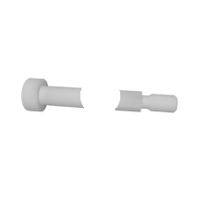
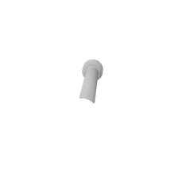

# Add Occlusion to Images

Sometimes images are subject to occlusion. If a human passes an object to another person, the hand hides a part of the object.

This script crops out circles from png's, and therefore mimics a hidden part.

### Requirements
* DataSet with *rendered images*
* numpy
* PIL

### Adjustments

Change `occultation_factor = 5` for your needs.  
This should crop an approximate amount of **1/3** of the object.  
After the script finished, you see a mean crop over the dataset.

### Fill out

> images_path   
save_path  

## Run

`python add_occlusion.py`

### Images

| middle crop | verge_crop |
|-------------|------------|
|||
