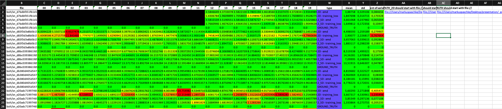

# Calculate EMD and Chamfer Distance for every viewport per object

1. Run eval_script in Pixel2Mesh directory (this produces full eval_full_loss.dat)
2. Copy evals for your needs (in our case 2D and 2.5D) into your preferred folder
3. Fill out `eval_2`and `eval_2_5` directory with your previously downloaded evals in the `calculate_standard_deviation.py` script.
4. Run `calculate_standard_deviation.py`

### Advanced
Ability to click on a cell in the excel sheet to open the corresponding obj \+ ground truth model from your harddrive.

1. Copy your predicted `.obj` files for 2D and 2.5D (demo_multiple.py in Pixel2Mesh folder) to a local folder.
2. Copy your generated `.dat`files to a local folder and run `dat_to_xyz.py`. (This is the ground truth point cloud)
3. Fill out the three paths (2D obj folder, 2.5D obj folder, xyz obj_folder) in the generated excel sheet to have a hyperlink to your object files.

### Example

